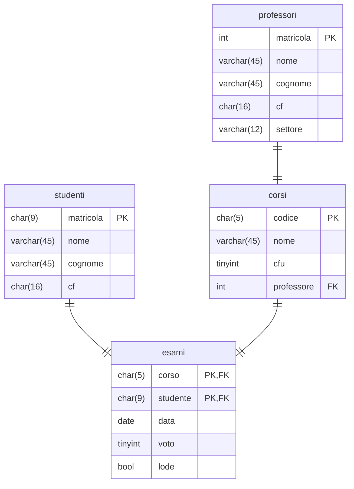

```mermaid
erDiagram
    studenti {
        char(9) matricola PK
        varchar(45) nome
        varchar(45) cognome
        char(16) cf
    }
    professori {
        int matricola PK
        varchar(45) nome
        varchar(45) cognome
        char(16) cf
        varchar(12) settore
    }
    corsi {
        char(5) codice PK
        varchar(45) nome
        tinyint cfu
        int professore FK
    }
    esami {
        char(5) corso PK,FK
        char(9) studente PK,FK
        date data
        tinyint voto
        bool lode
    }
    professori ||--|| corsi : " "
    studenti ||--|| esami : " "
    corsi ||--|| esami : " "
```
